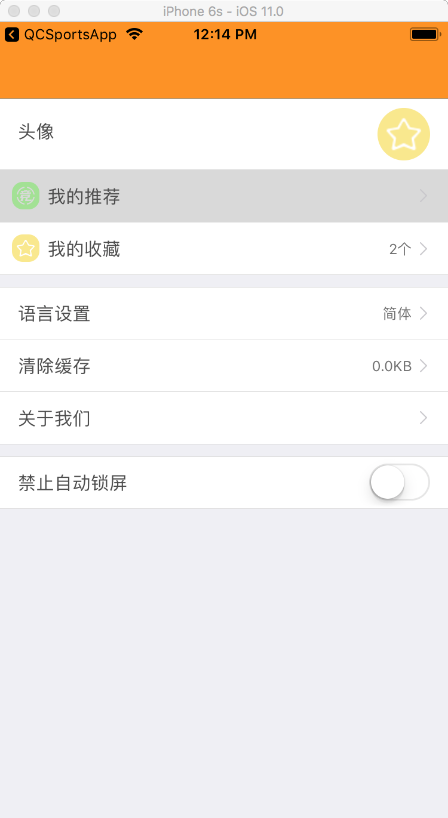

# SXSettingTableView

## 效果
------



用法
------

```Objective-C
SXSettingItem *item01 = [SXSettingCustomItem itemWithTitle:@"头像" image:[UIImage imageNamed:@"ic_center_menu_gz"]];
    item01.rowHeight = 60;
    item01.option = ^(SXSettingItem *item){
        
    };
    SXSettingItem *item02 = [SXSettingArrowItem itemWithIcon:@"ic_center_menu_jc" title:@"我的推荐" destVcClass:[UserViewController class]];
    
    SXSettingItem *item03 = [SXSettingArrowItem itemWithIcon:@"ic_center_menu_gz" title:@"我的收藏" text:@"2个" destVcClass:nil];
 
    SXSettingGroup *group1 = [[SXSettingGroup alloc] init];
    group1.items = @[item01,item02,item03];
    
    
    SXSettingArrowItem *item10 = [SXSettingArrowItem itemWithTitle:@"语言设置" text:@"简体" destVcClass:nil];
    
    item10.option = ^(SXSettingItem *item){
        SXSettingArrowItem *newItem = (SXSettingArrowItem *)item;
        if ([newItem.text isEqualToString:@"简体"]) {
            newItem.text = @"繁体";
        }else {
            newItem.text = @"简体";
        }
        [self.tableView reloadData];
    };
    
    SXSettingSwitchItem *item11 = [SXSettingSwitchItem itemWithTitle:@"禁止自动锁屏"];
    item11.switchOption = ^(UISwitch *mySwitch){
        if (mySwitch.on) {
            [UIApplication sharedApplication].idleTimerDisabled = YES;// 不自动锁屏
        }else{
            [UIApplication sharedApplication].idleTimerDisabled = NO;// 自动锁屏
        }
    };
    
    SXSettingArrowItem *item12 = [SXSettingArrowItem itemWithTitle:@"清除缓存" text:@"227MB" destVcClass:nil];
    __weak SXSettingArrowItem *weakItem = item12;
    item12.option = ^(SXSettingItem *item){
        weakItem.text = @"0.0KB";
        [self.tableView reloadData];
    };
    SXSettingItem *item13 = [SXSettingArrowItem itemWithIcon:nil title:@"关于我们" destVcClass:[UserViewController class]];
    SXSettingGroup *group2 = [[SXSettingGroup alloc] init];
    group2.items = @[item10,item12,item13];
    
    SXSettingSwitchItem *item21 = [SXSettingSwitchItem itemWithTitle:@"禁止自动锁屏" isOn:YES];
    item21.switchOption = ^(UISwitch *mySwitch){
        if (mySwitch.on) {
            [UIApplication sharedApplication].idleTimerDisabled = YES;// 不自动锁屏
        }else{
            [UIApplication sharedApplication].idleTimerDisabled = NO;// 自动锁屏
        }
    };
    
    SXSettingGroup *group3 = [[SXSettingGroup alloc] init];
    group3.items = @[item21];
    
    self.groups = [NSMutableArray arrayWithArray:@[group1, group2, group3]];
    [self.tableView reloadData];
```
